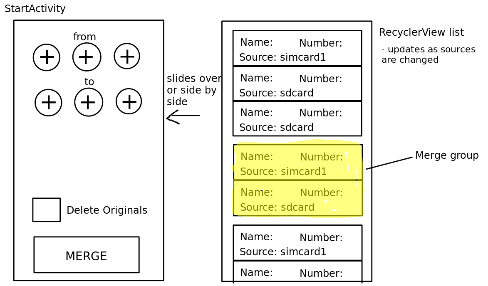

# ICT376 TEAM 3 PROJECT - CONTACT MERGER

## TEAM MEMBERS
* Finnian Ryan (32207184)
 ** finnian_ryan@iinet.net.au
* Dave Gwee (32529732)
** davegwee94@gmail.com
* Kaito Kamiyama (31526732)
 ** kaitok05@hotmail.com

## Project Description
An app that will merge contacts from various sources. The user will include or disclude sources such as sdcard, sim card, internal storage, etc, and choose which contacts to merge; or have likely merge candidates automatically selected. They will then be guided through any user input needed, such as choosing between conflicting information in a certain field; eg different addresses. The program will take automatic merge measures, such as names that are the same albeit with different capitalization. The user will be able to look at and manually change and fields. A common use would be merging duplicate contacts between a sim card and sd card (eg when switching to new phone) and produce a clean new list without duplicates.
## PLATFORM
* We are targeting Android.
* Minimum version is 4.2 API 17. Lower if we can.

## USER INTERFACE & INTERACTIONS
### DESCRIPTION
The interface will guide the user through the process of merging a selection of contacts, so each activity will be used sequentially without any back and forth. There are 3 planned activities mirroring 
the 3 stages of the process; selecting contact sources to merge and where output; deciding on field conflicts & confirming merged data; and confirmation of what has been done.
#### StartActivity
Here the user will decide which contact sources to merge contacts from, and which contact database(s) to place them into. Options such as whether to keep or delete originals will be present. A hideable pane, a RecyclerView fragment, will present a list of all contacts from selected sources organised into groups that will be merged together. The user will be able to modify these groups. On phone screens, this would slide over the base activity fragment, while on larger tablet screens in landscape view, it would slide to fill half the screen. This activity will have a 'start merge' button to move to the next activity.

#### ConfirmActivity

####DetailsActivity

### CONCEPTS

## DATABASES
* We will be using the ContactsContract android api class to access the systems internal contacts database.
* Using this we can get a handle to the database (what android calls a cursor) to use with SQL queries.
* We may also need to create an additional database (using android's internal SQLite) to store modified/new contacts before they are saved to the systems contacts.

## MOBILE SPECIFIC FEATURES
* In the 'conflicts' activity, where a user gets to decide between conflicting data, the gyroscope can be used to 'tip' to one side or the other, to select the preferred field information.
* This may only be implemented when there is a choice between two pieces of information per field.

## NOTE:
I am using a program, pandoc, to convert github markdown (these .md files) to pdf format. 
Invoking with 'pandoc -V fontenc=LY1 -f markdown_github -t latex -o project_description.pdf README.md' in the project directory.
